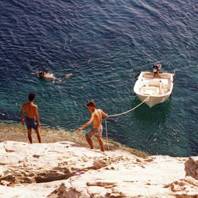

<!-- Big image> -->

# Bienvenu.e a mon blog Voyage-Voyage!

  
##Ce mois on rêve d'Amerique du Sud, ses plages, ses fôrets, ses cultures colorées.
  

| | | | |
|:--:|:--:|:--:|:--:|
|*Sao Paolo* **Brésil** |*San Pedro de Atacama* **Chili** |*Buenos Aires* **Argentine** |*Machu Pichu* **Pérou** |

  

## Amerique du Sud
  

| | |
|:--:|:--:|
|| Voyage au **Brésil**, voyage au pays de la décontraction, de la diversité, du métissage, de la musique et du plaisir ! Tous brésiliens ! Heureusement la mer les a protégés, longtemps, ceux que l’on a appelés les Indiens. Pourtant c’est aussi elle qui les amenés, les Espagnols, les Portugais, les Africains (avec eux Dieu et les soutanes, la grippe, les corsets). La mer du Brésil sent la vie en cadence. Sa vie à elle selon les marées, les odeurs d’algues, de coquillages. La vie et le rythme des hommes, l’activité des ports, les villages de pêcheurs, filets, bois mouillé de barques, le week-end et la plage, peau tannée salée, rhum et crème glacée. Les Brésiliens sont les rois des plages, experts de plaisir sur sable chaud.|
| | Faire un voyage au **Chili**, c’est un peu comme changer de planète. Se retrouver dans les paysages surréalistes du désert de l’Atacama, l’un des plus arides au monde, qui se couvre pourtant de fleurs miraculeuses au passage d’El Niño. Il abrite des reliefs tourmentés, lunaires, où l’homme semble ne s’être jamais aventuré. Pourtant, nos pas sont réels sur ces terres ocre aux cratères terrestres. Malgré la pesanteur, on se sent proche des étoiles et, la nuit, il suffirait presque de tendre la main pour les toucher. Des légendes, le Chili peut en conter à l’infini. Fiefs de marins, Valparaiso et Chiloé évoquent à elle seules les beautés protégées par les vagues, l’isolement que l’on brave à coup de convivialité. Mais c’est dans les territoires extrêmes du septentrion que finit de s’exprimer la superbe chilienne. La Patagonie, confins des confins, sauvage et indomptable, étale à nos pieds ses glaciers craquants et ses lacs d’icebergs bleus. Vraiment une autre planète.  |
| | Séjourner à **Buenos Aires** pour y vivre ses petits matins, trainer dans les rues haussmanniennes mais trop chaudes pour être Paris, prolonger la nuit entre bars et milonga, fasciné par l’ondulation des corps, le mouvement de la main, la fluidité des gestes, un petit coup de tango argentin, séduction bien latine, ballet de la comédie humaine. Il y a aussi le bœuf, le Bife de Lomo et le mate au goût râpeux, vite addictif, Che ! Et puis on prend la route, pour un voyage sur la trans-patagonienne, toujours plus bas, Fitz Roy, Perito Moreno, et au fond de la Terre de Feu, découvrir Ushuaia et ses baraques, c’est le bout du monde.|
| | Voyage au **Pérou** : on a goûté à la forêt moite de l’Amazonie, on a rêvé face aux dessins géants de Nazca – œuvres d’astronomes géniaux, d’artistes fous ou d’extraterrestres, on a suivi le chemin des Incas jusqu’au Machu Pichu, on a croisé les Uros du lac Titicaca, sur leurs îles de roseaux mouvantes, et maintenant, au dessus de nos têtes plane le grand condor des Andes. On a pris le bus ce matin pour le voir à l’aube, bien sûr, comme un seigneur, le maître s’est fait attendre. Il flotte là maintenant, en chair et en os, angoissant et protecteur à la fois, trop grand pour n’être qu’un oiseau.|

 
 
## Mes top 9 conseils pour bien voyager
 

||**1. Pensez à vos papiers 2. Définissez avec soin votre budget  3. Partez au bon moment  4. Emportez moins de choses  5. Evitez la file de sécurité où il y a des enfants 6. Jetez un coup d’œil derrière vous 7. Apportez une banane ET un portefeuille  8. Soyez flexible  9. Langues et expressions clés**  | 
|:--:|:--:|
| ||

 
 

## Mes dernières destinations
### Parce que chaque voyage est différent
 

| |  |  | | | | | | |
|:---------:|:--------:|:--------:|:--------:|:---------:|:--------:|:--------:|:---------:|:---------:|
| Chypre | Grèce | Inde | Italie | Kenya | Madagascar | Nouvelle-Zélande | Réunion | USA |
 

